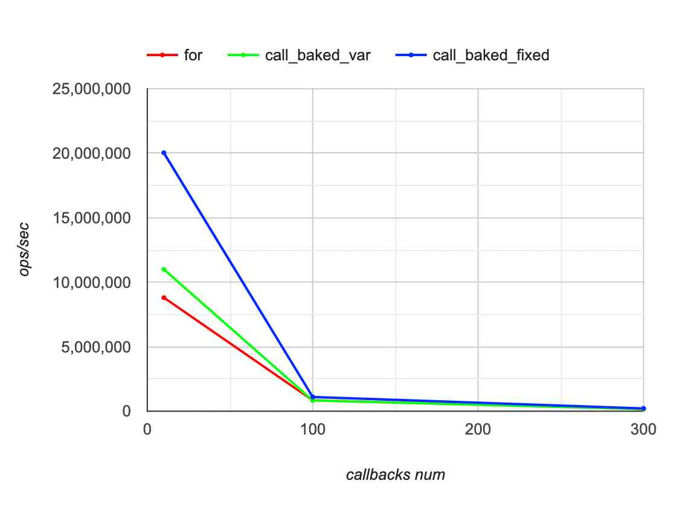

node v16.13.0
macbook pro m1

notes (5apr-2023):

emitix has non standart api for `once` method (does not return self)  
eventemitter2, Drip, event-emitter, contra/emitter does not handle `listeners` method correctly  

results:

[26sep-2024](./results.sep26-2024.md)
[5apr-2023](./results.apr5-2023.md)
[oct20-2019](./results.oct20-2019.md)

